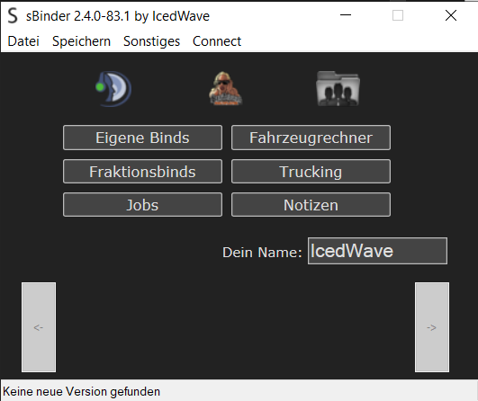

# sBinder

Der sBinder ist ein Keybinder für den [GTA:SA:MP](https://www.sa-mp.com/)-Server [Nova eSports Newlife](https://nes-newlife.de).

[Forumpost](https://forum.nes-newlife.de/thread/1544-sbinder-by-icedwave/?postID=11308)

## Features

- Viele benutzerdefiniert belegbare Hotkeys
- Vordefinierte Fraktionsbinds für viele Fraktionen von nes-newlife.de
- Erweiterte Online-Funktionen wie das Abrufen von Spielerinformationen (`/playerinfo`), Fraktionsmitgliedern (`/checkfrak`) und Trucking-Informationen (`/trucking`)
- Integrierter Wantedkatalog für Staatsfraktionen (s. [Wantedbinds](Wantedkatalog.md))
- Erweiterte Funktionen für Binds wie das Eingeben von IDs, Wartezeiten zwischen Binds, etc.
- Verschiedene Designs
- Integrierter Fahrzeugrechner
- Benutzerdefinierte Textbinds

## FAQ

### Wird der sBinder noch weiterentwickelt?

Nein. Ihr könnt hier oder im Forum Bugs melden, aber wenn diese gefixt werden _habt ihr Glück gehabt_. Neue Features kommen definitiv keine mehr!

### Warum ist der Code so hässlich?

Ich habe mit dem sBinder angefangen als ich 13 war, damals kannte ich noch keine Code Style Guidelines. Außerdem ist das auf AutoHotkey sowieso nur schwer anwendbar; das ganze ist irgendwann einfach aus dem Ruder gelaufen.

### Kann ich den Code weiterverwenden?

Ja, gerne. Der sBinder ist unter der permissiven MIT-Lizenz lizenziert, ihr könnt den Code also gerne für alle Zwecke verwenden.
